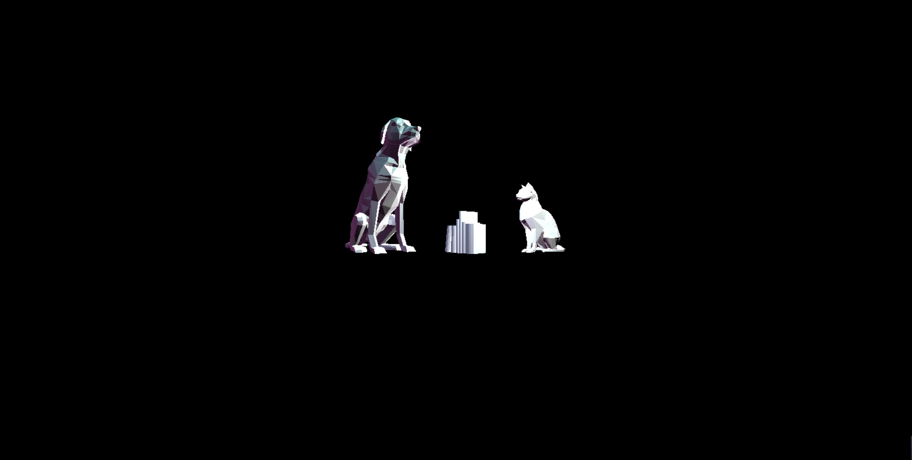

# CMPM163Labs
## Lab2
Video of three cubes: https://drive.google.com/file/d/1DCLsHrDMSCu6va6qQsYKB-LuMusY_t8h/view?usp=sharing;   
Images of three models:   
;

## Lab3
Video: https://drive.google.com/file/d/10qXukjTORgHv-w0WUx7G3s5rTND4yqnz/view?usp=sharing     
Materials of cubes(from left to right): 
1. Its color interpolates between two input colors (#ADFF2F and #FF00FF)    
2. This cube was the result of first part of the lab and is a grey/white cube   
  3. Its color interpolates between two input colors as introduced in part 2 (#ACB6E5 and #74ebd5)    
4. The rotating one, its material is made by source code from three.is material examples (new THREE.MeshBasicMaterial( { color: 0xffaa00, transparent: true, blending: THREE.AdditiveBlending } ) )   

## Lab4
Video:https://drive.google.com/file/d/1v_yjcRgrqoxB_kWA-L-6V6LEiIN_8BLq/view?usp=sharing    
Cubes(from left to right):  
1. The 3rd cube, new texture/normal map combo, material 173b.jpg and 173_norm.jpg.    
2. The 2nd cube, made by following instructions, texture map without normal map, material 157.jpg.    
3. The 1st cube, made by following instructions, texture/normal map combo, material 157.jpg and 157_norm.jpg.
4. The 4th cube, made by following instructions, loaded texture using shaders, material 172.jpg.    
5. The 5th cube. I tried to make this cube by having .frag and .vert files, but I found that's difficult. I changed to use codes from instructions and adjusted them. So I multiplied vUv by a float, and made a new vec2 called tiles. Then multiplied it with vUv in fract() to get fractional part. Therefore I can repeat the texture.    
    
Answers:    
  a. x = u*8  
  b. y = 8-8v   
  c. white
