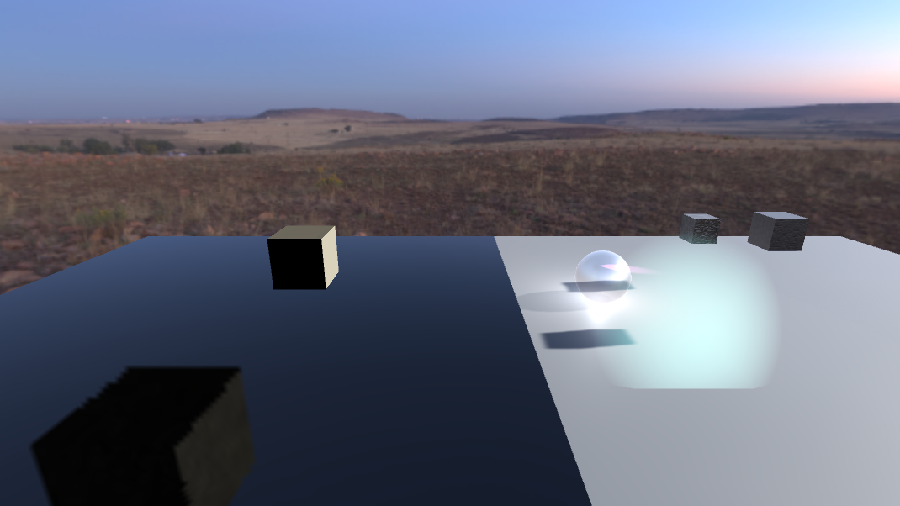
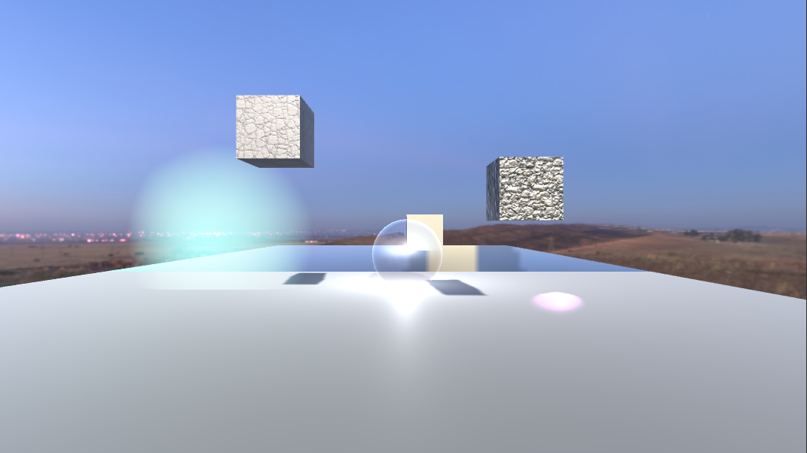
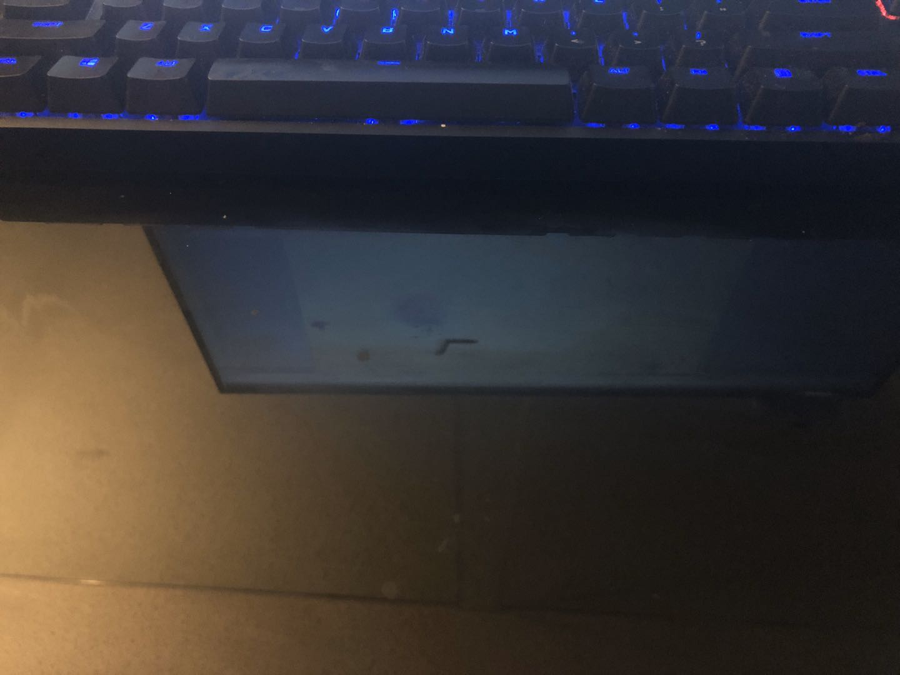
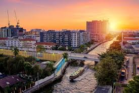
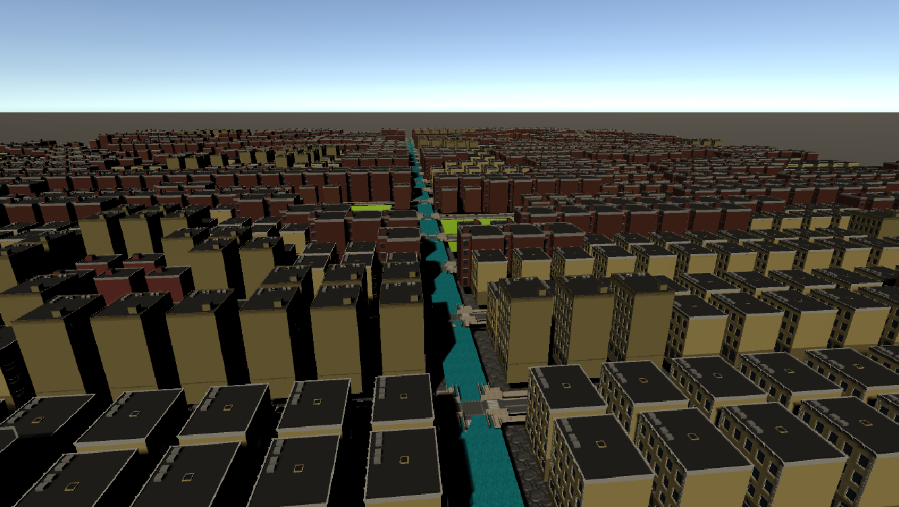

# CMPM163Labs
## Lab2
Video of three cubes: https://drive.google.com/file/d/1DCLsHrDMSCu6va6qQsYKB-LuMusY_t8h/view?usp=sharing;   
Images of three models:   
;

## Lab3
Video: https://drive.google.com/file/d/10qXukjTORgHv-w0WUx7G3s5rTND4yqnz/view?usp=sharing     
Materials of cubes(from left to right): 
1. Its color interpolates between two input colors (#ADFF2F and #FF00FF)    
2. This cube was the result of first part of the lab and is a grey/white cube   
  3. Its color interpolates between two input colors as introduced in part 2 (#ACB6E5 and #74ebd5)    
4. The rotating one, its material is made by source code from three.is material examples (new THREE.MeshBasicMaterial( { color: 0xffaa00, transparent: true, blending: THREE.AdditiveBlending } ) )   

## Lab4
Video:https://drive.google.com/file/d/1v_yjcRgrqoxB_kWA-L-6V6LEiIN_8BLq/view?usp=sharing    
Cubes(from left to right):  
1. The 3rd cube, new texture/normal map combo, material 173b.jpg and 173_norm.jpg.    
2. The 2nd cube, made by following instructions, texture map without normal map, material 157.jpg.    
3. The 1st cube, made by following instructions, texture/normal map combo, material 157.jpg and 157_norm.jpg.
4. The 4th cube, made by following instructions, loaded texture using shaders, material 172.jpg.    
5. The 5th cube. I tried to make this cube by having .frag and .vert files, but I found that's difficult. I changed to use codes from instructions and adjusted them. So I multiplied vUv by a float, and made a new vec2 called tiles. Then multiplied it with vUv in fract() to get fractional part. Therefore I can repeat the texture.    
    
Answers:    
  a. x = u*8  
  b. y = 8-8v   
  c. white

## Lab5
Video:https://drive.google.com/file/d/1jHS5BvK1LYfED79uJLMY5Vbbaa3z4min/view?usp=sharing    
The particle at left rear wheel is made by following the tutorials but different color. The right rear wheel one is another kind of particle. Then, I changed the materials of track, actually the colors. I also changed the skybox. I downloaded a new skybox from hdrihaven.com, then added it into the project and changed its texture shape to cube. Then created a new materail for skybox and applied this new one. Also, I changed the game to knock down the pins, which did by following the tutorial in Unity Learn.

## Lab6
Images:     
;
;   
    
Lights:   
1.Point light works like a light bulb, it will illuminate things based on the light's position, the light shows equally to all directions.    
2.Directional light works like the sun, lighting things based on the direction of the light, set by the objects rotation.     
3.Spot light works like a flashlight or headlamps on a car, they point in a direction based on their transforms rotation and illuminate all objects within a cone. It respond to bith rotation and position.    
4. Area light only work when baking a light map. Area lights shine in all directions to one side of a rectangular plane.    

Material:   
My computer desk:   
;
    
So I first created a material in balck, then adjusted both values of metallic and smoothness to 1. I also added a reflection probe to  make it reflect lights like my desk.     
    
Textures:     
There are 2 cubes with different textures. These textures are downloaded from Lab4 assets. I applied them to the deault cubes.    
    
Skybox:     
I just used the same skybox as Lab5. 

## Lab7
Video: https://drive.google.com/file/d/1HQA7oFRvcRLslXNHXn_Qx3jGOr1KT110/view?usp=sharing;    

## Lab8
link: https://github.com/Jcream1/163lab8.git    
    
Image of the real city:     
;   
Image of generated city:    
;    
    
I was trying to build the river and the bridge. I replaced xstreet(or zstreet, I forgot) which generated by following toturial with river, then I adjusted its distribution so there won't be too many rivers in the city. The difficult is to generating the bridge. Firstly I tried to find a bridge model from assets store but most of them don't support game form. Then I tried to generate buildings and streets on another thin ground layer, so the river will looks a little bit lower than them. In this case streets can just go across and above the river. The fact is that I met lots of problems and I don't have enough time to modify the city. So, at the last I just generated rivers.    
    
Partner: We showed each other our works and that's all. 
